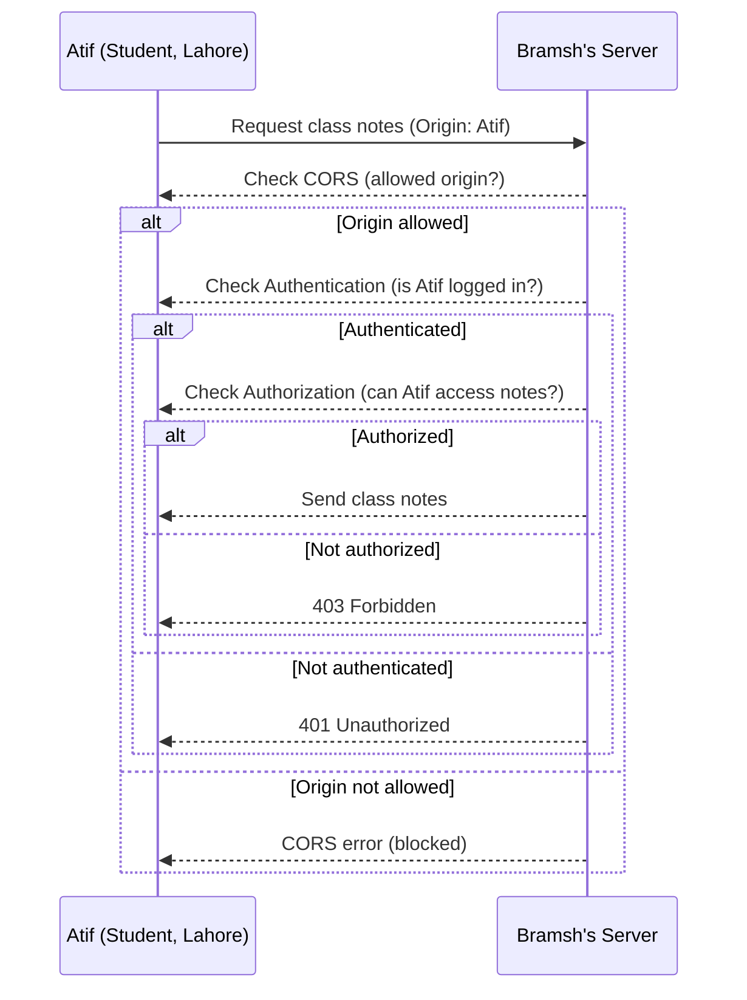
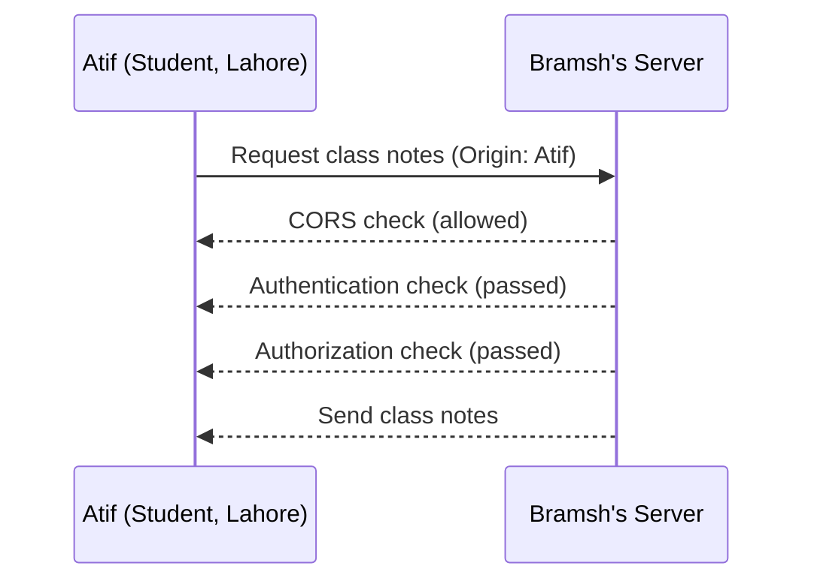
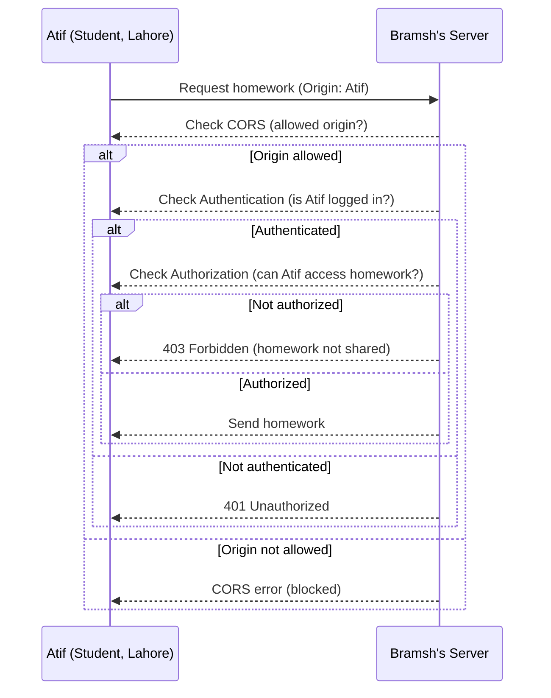
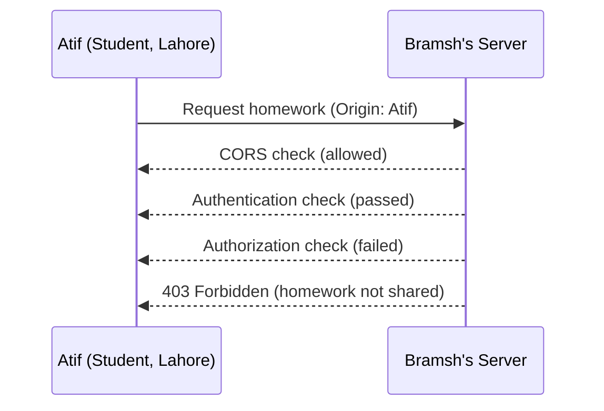
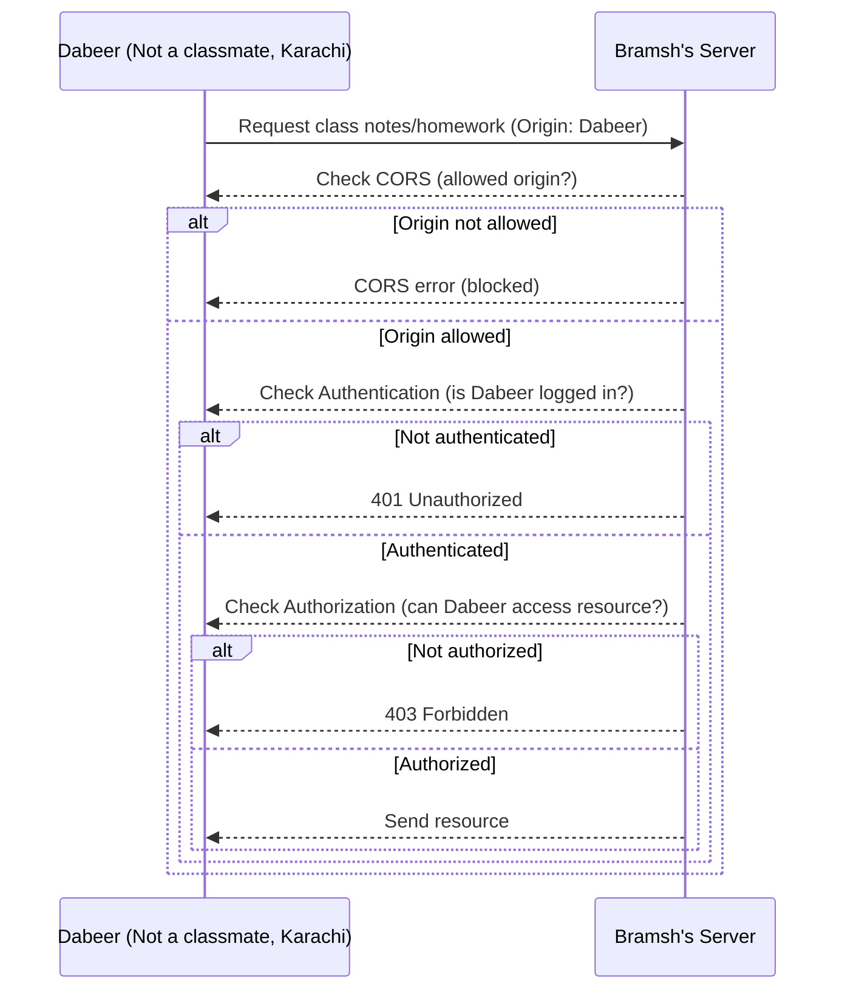
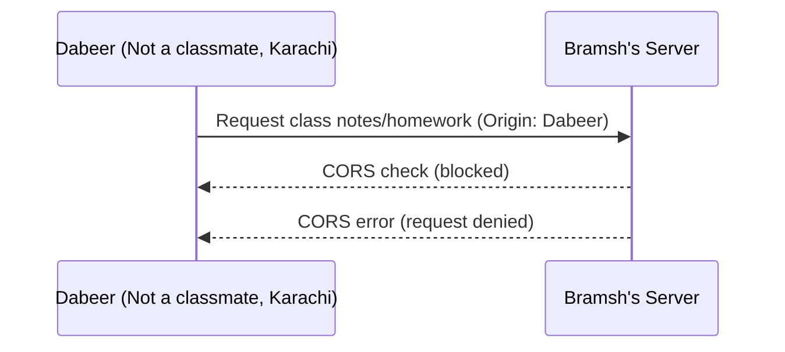
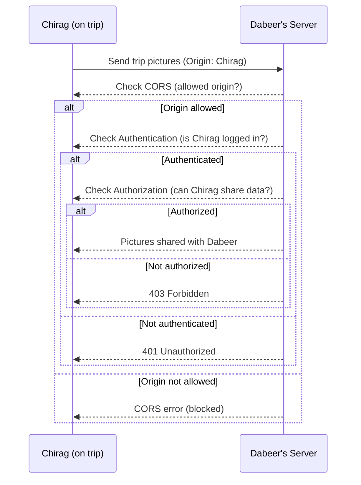
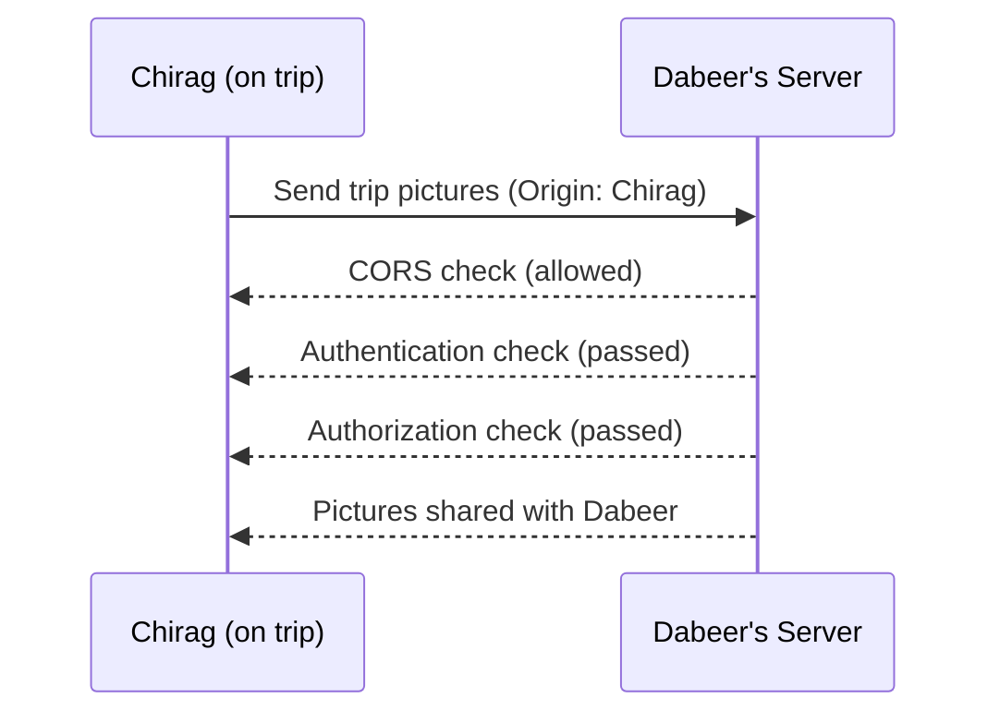

# Day 01: Web Engineering Terminologies

## Overview

Welcome to Day 01 of the Web Engineering teaching journey! Today, we focused on foundational web concepts, setting the stage for future lessons on web development.

## Topics Covered

- [What is the Internet?](#1-internet--web)
- [What is the Web?](#1-internet--web)
- [Web server vs. web client](#2-web-server--web-client)
- [Web resources and data](#3-web-resources--data)
- [IP addresses (IPv4 & IPv6)](#4-ip-addresses)
- [Public, private, intranet, and extranet networks](#5-types-of-networks)
- [Authentication & Authorization](#6-authentication--authorization)
- [Protocols (HTTP, etc.)](#7-protocols)
- [Origin and Cross-Origin Resource Sharing (CORS)](#8-origin--cors)
- [HTTP request and response (structure and flow)](#9-http-request--response)
- [Example Diagrams](#example-diagrams)

## Lesson Content

### 1. Internet & Web

- **Internet:** Interconnected network of computers.
- **Web:** A layer on top of the internet, providing access to web resources.

### 2. Web Server & Web Client

- **Web server:** Computer that serves resources and provides services.
- **Web client:** Computer (often a browser) that requests resources from a web server.

### 3. Web Resources & Data

- **Web resource/data:** Information available on the web (e.g., web pages, files).

### 4. IP Addresses

- **IP address:** Unique identifier for a device on a network.
- **IPv4:** 32 bits (e.g., 192.168.1.1)
- **IPv6:** 128 bits (e.g., 2001:0db8:85a3:0000:0000:8a2e:0370:7334)

### 5. Types of Networks

- **Public network:** Global, accessible by everyone.
- **Private network:** Home or small office.
- **Intranet:** Internal to an organization.
- **Extranet:** Extended internal network for partners.

### 6. Authentication & Authorization

- **Authentication:** Verifying identity (e.g., login).
- **Authorization:** Permission to access a resource.

### 7. Protocols

- **Protocol:** Set of rules for communication (e.g., HTTP, HTTPS).
- **HTTP:** HyperText Transfer Protocol, used for web communication.

### 8. Origin & CORS

- **Origin:** Source of a web resource (domain, protocol, port).
- **CORS:** Cross-Origin Resource Sharing, controls resource sharing between different origins.

### 9. HTTP Request & Response

- **Request:** Sent by client to server, asking for a resource.
- **Response:** Sent by server to client, providing the resource or an error.

#### Sample HTTP Request Data Structure

An actual HTTP request is plain text, consisting of a request line, headers, and (for some methods) an optional body. Here is a sample GET request with clearly labeled parts:

```http
GET /notes HTTP/1.1        # Request line: method, path, and HTTP version
Host: niw.edu.pk           # Header: specifies the target host
User-Agent: Mozilla/5.0    # Header: identifies the client software
Accept: text/html          # Header: tells the server what content types are acceptable
                           # (No request body for GET requests)
```

This request asks the server at `niw.edu.pk` for the `/notes` resource. The lines after the request line are headers, which provide extra information about the request. For GET requests, there is typically no request body.

## Example Diagrams

Below are Mermaid diagrams illustrating CORS, authentication, and authorization concepts using real-world scenarios:

### 1. CORS, Authentication & Authorization: Bramsh and Atif

#### Scenario 1: Atif requests Bramsh's class notes (CORS, AuthN, AuthZ pass)



**Description:**
Atif, a student from Lahore, requests class notes from his class fellow Bramsh. Bramsh's server is configured to allow CORS for Atif's origin. Atif is authenticated and authorized to access the notes, so the server sends the notes to him.

#### Scenario 1: Executed Flow



---

#### Scenario 2: Atif requests Bramsh's homework (Authorization fails)



**Description:**
Atif tries to access Bramsh's homework from Bramsh's server. While CORS and authentication checks pass, the server is configured to only authorize Bramsh to access her own homework. Authorization fails for Atif, so he receives a 403 Forbidden response.

#### Scenario 2: Executed Flow



---

#### Scenario 3: Dabeer (not a classmate) tries to access Bramsh's server (all checks fail)



**Description:**
Dabeer, who is not a classmate and is from Karachi, tries to access resources from Bramsh's server. The server's CORS policy blocks his origin, so the request is denied at the CORS check and does not proceed to authentication or authorization.

#### Scenario 3: Executed Flow



---

#### Scenario 4: Chirag shares trip pictures with Dabeer (Authorization passes)



**Description:**
Chirag, who is on a trip, sends his trip pictures to his brother Dabeer's server. The server allows Chirag's origin, he is authenticated, and authorized to share data, so the pictures are successfully shared with Dabeer.

#### Scenario 4: Executed Flow



---

## Reflections

Today's session was interactive and set a strong foundation. Learners discussed real-world analogies and scenarios to understand web basics.

## Next Session

**Topic:** Introduction to HTML (HyperText Markup Language)

---
[Back to Root README](../README.md)
