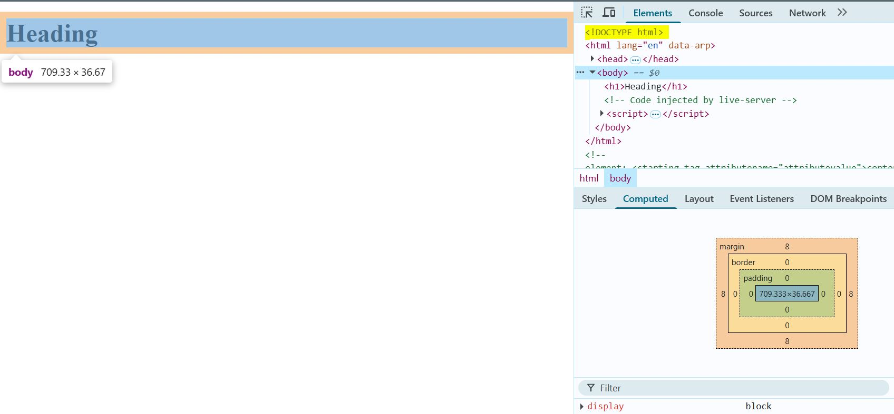
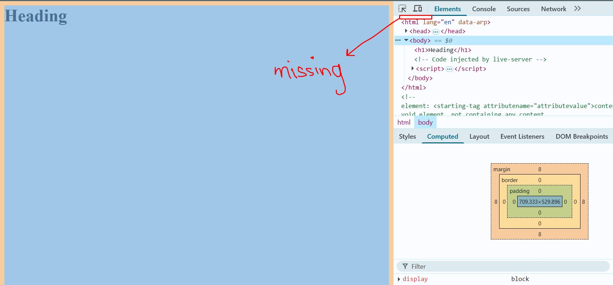
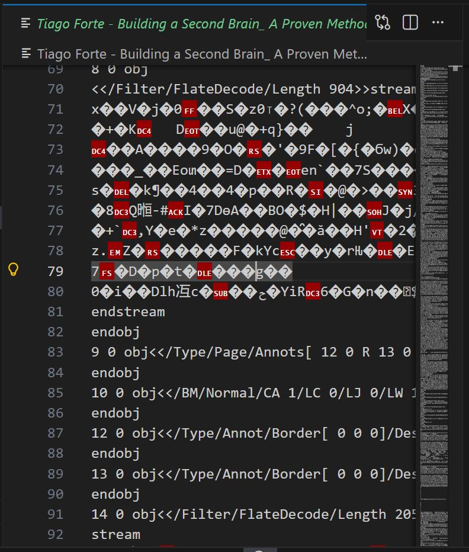
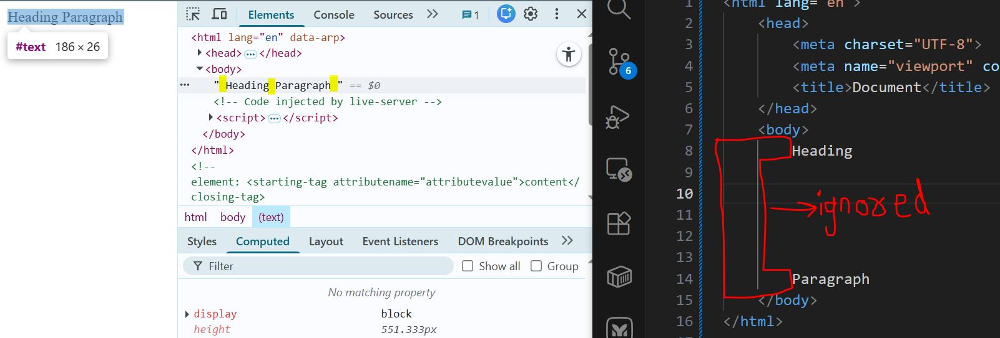
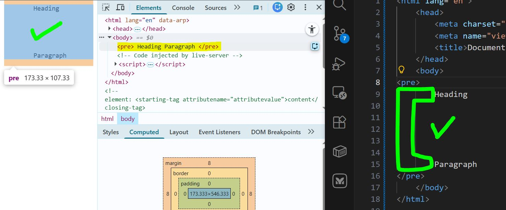
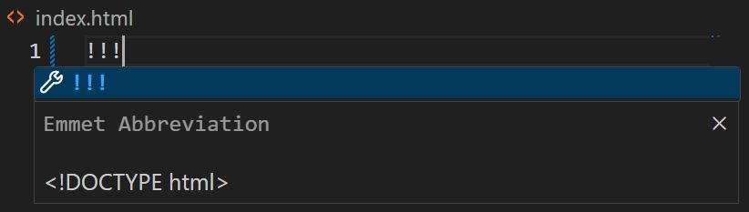
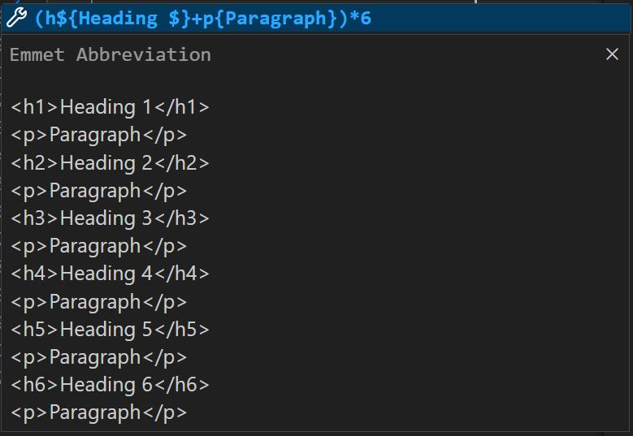

# Day 02: HTML, HyperText, Markup, DTD, and More

## Topics Covered

### 1. HyperText Meaning and Examples

- **Definition:** HyperText refers to text that contains links to other texts. It allows navigation between documents or within the same document.
- **Examples:**
  - **MS Word Hyperlink:** Demonstrated how hyperlinks work in MS Word.
  - **Web Page Links:** Showed how anchor (`<a>`) tags create links between web pages.

### 2. HTTP and HTML Relationship

- **HTTP:** The protocol used to transfer HTML documents over the web.
- **HTML:** The markup language used to structure web pages.
- **Relation:** HTTP delivers HTML documents to browsers, which then render them.

### 3. Markup Language and Markup

- **Markup Language:** A system for annotating a document in a way that is syntactically distinguishable from the text.
- **Markup:** The tags or annotations (like `<h1>`, `
`) that define structure and meaning.
- **Examples:**
  - `<h1>This is a heading</h1>`
  - `
This is a paragraph.
`

### 4. HTML DTD (Document Type Declaration)

- **What is DTD:** The `<!DOCTYPE html>` declaration defines the document type and version of HTML.
- **Importance:**
  - Ensures browsers render the page in standards mode.
  - Skipping DTD can cause browsers to use quirks mode, leading to inconsistent rendering.
- **Demonstration:** Used Chrome DevTools Elements tab to show the effect of DTD.
  - 
  - 

### 5. HTML Element Attributes

- **Definition:** Attributes provide additional information about HTML elements.
- **Examples:**
  - `lang` attribute in `<html lang="en">` specifies the language of the page.
  - Other attributes: `id`, `class`, `src`, `href`, etc.

### 6. Head vs Body Elements

- **`<head>`:** Contains meta-information, title, links to stylesheets, scripts, etc.
- **`<body>`:** Contains the visible content of the web page.

### 7. Meta Elements in Head

- **`<meta charset="UTF-8">`:** Sets character encoding to UTF-8.
- **`<meta name="viewport" content="width=device-width, initial-scale=1.0">`:** Controls layout on mobile browsers.

### 8. UTF-8 vs ASCII

- **ASCII:** 256 characters, basic English letters and symbols.
- **UTF-8:** 1 to 4 bytes per character, supports all Unicode characters.
- **Demonstration:**
  - Opened a PDF in VS Code using an extension.
  - Changed `.pdf` to `.txt` to see how text is rendered (unsupported/misrepresented characters).
  - 
  - 

### 9. Setting the Webpage Title

- Used the `<title>` tag inside `<head>` to set the page title.

### 10. Whitespace Handling in HTML

- Browsers collapse consecutive whitespaces.
- 
- Used `<pre>` tag to preserve whitespace and line breaks.
- 

### 11. Void Tags

- Tags that do not have closing tags or content.
- Examples: ` ` (line break), `
` (horizontal rule).

### 12. Headings and Paragraphs Practice

- Created 6 headings (`<h1>` to `<h6>`), each followed by paragraphs.

### 13. Emmet Abbreviations

- Used Emmet shortcuts for rapid HTML generation:
  - `!` for boilerplate
  - 
  - `!!!` for DTD
  - 
  - `p` and `h$` for paragraphs and headings, `{}` for content
  - 

### 14. CSS Box Model Overview

- Every HTML element is a box (content, padding, border, margin).
- Briefly discussed the composition of the box model.

---

## Resources & References

- [MDN Web Docs: HTML](https://developer.mozilla.org/en-US/docs/Web/HTML)
- [MDN Web Docs: HTML elements reference](https://developer.mozilla.org/en-US/docs/Web/HTML/Element)
- [Emmet Documentation](https://docs.emmet.io/)

---

[Back to Main README](../README.md)
