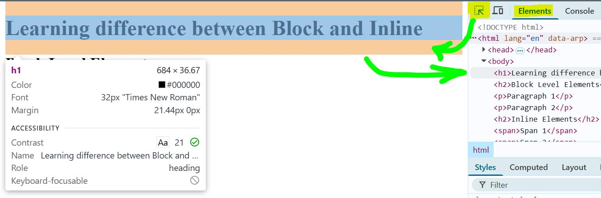
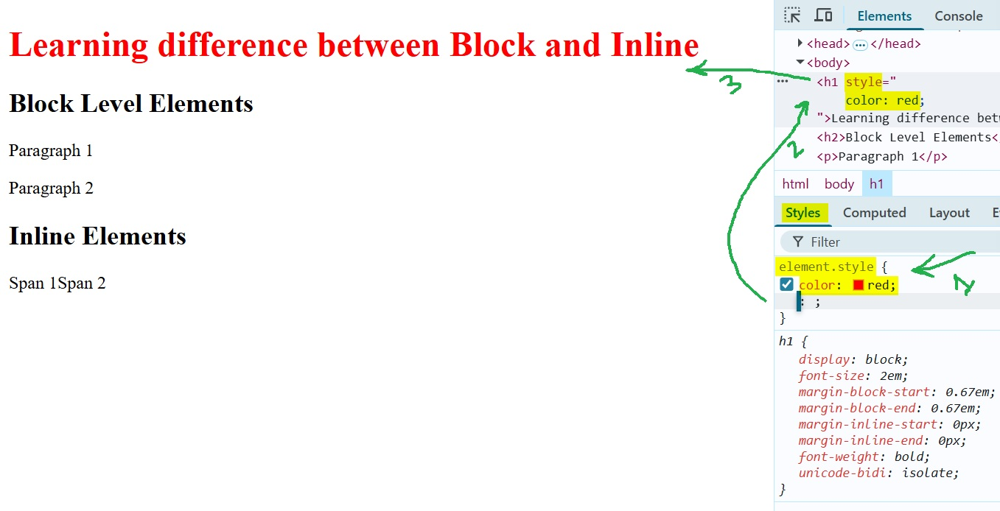
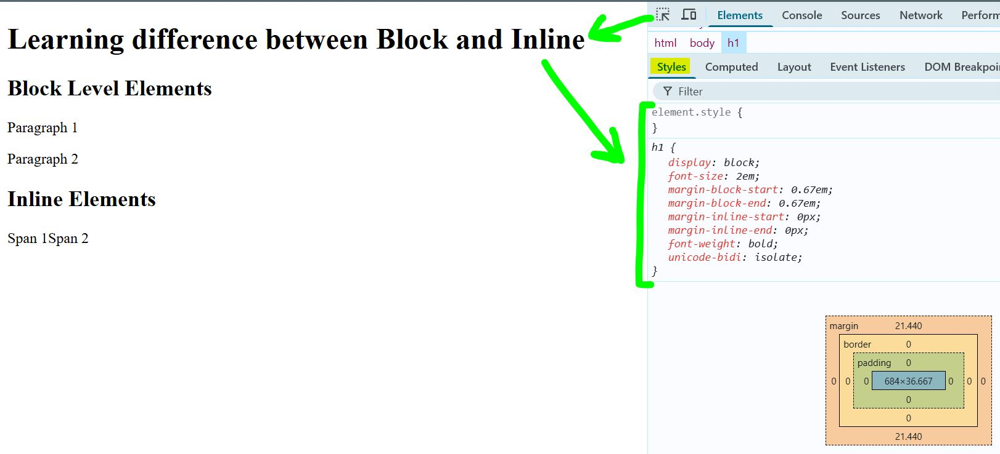
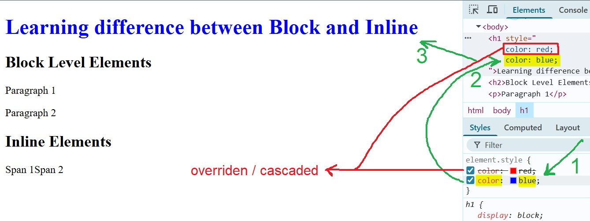
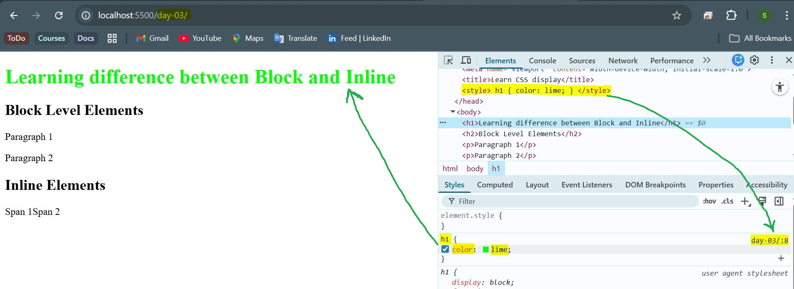
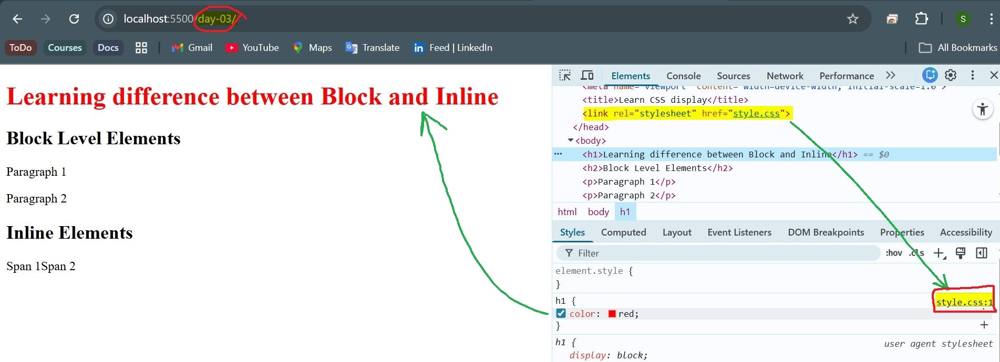
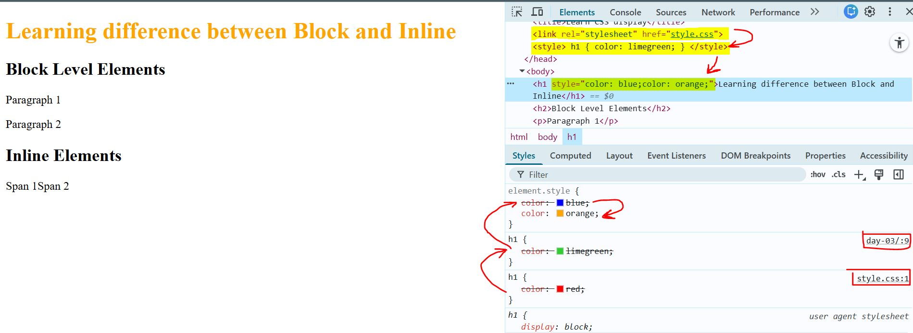
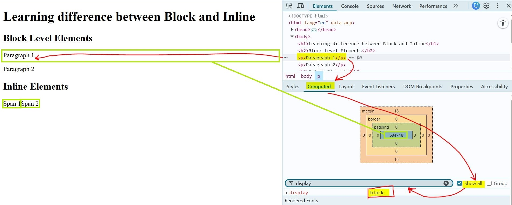
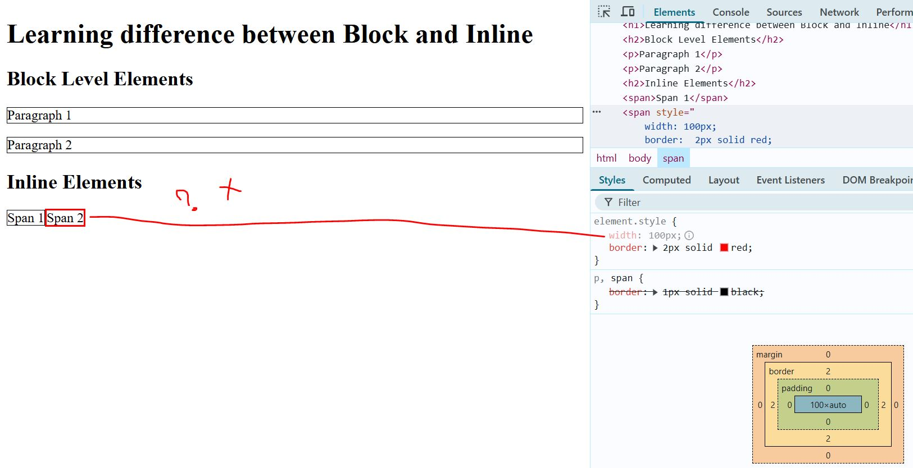
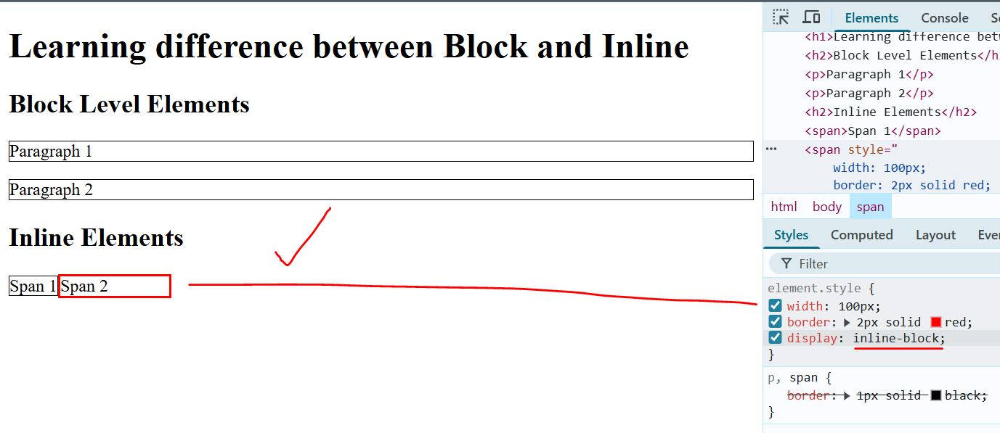

# Day 03: Introduction to CSS, Chrome DevTools, Block vs Inline Elements

## Table of Contents

- [1. Chrome DevTools: Element Selection & Inspection](#1-chrome-devtools-element-selection--inspection)
- [2. Inline CSS via DevTools](#2-inline-css-via-devtools)
- [3. Internal CSS](#3-internal-css)
- [4. External CSS](#4-external-css)
- [5. CSS Specificity (Brief Overview)](#5-css-specificity-brief-overview)
- [6. Block vs Inline Elements](#6-block-vs-inline-elements)
- [7. DevTools Features Practiced](#7-devtools-features-practiced)
- [Reflections](#reflections)

## Topics Covered

### 1. Chrome DevTools: Element Selection & Inspection

> [!TIP]
> **Element Selection:** Use the element selection tool in Chrome DevTools to quickly highlight and inspect any element on a webpage.
>
> 
> *Selecting an element focuses its HTML code in the `Elements` tab, making it easy to view and edit the structure.*

**Editing CSS Rules:** CSS rules can be edited directly in DevTools for experimentation. The same changes can be made in your source HTML/CSS files for persistence.


*Editing a property in DevTools instantly updates the page, but changes are not saved to your files unless you update them manually or download the changed webpage.*

> [!TIP]
> **Styles Tab:** The `Styles` tab displays all CSS rules applied to the selected element. You can view, add, or modify CSS properties live.
>
> 
> *The right panel shows all CSS rules, their sources, and allows for real-time editing.*

### 2. Inline CSS via DevTools

> [!TIP]
> **Adding and Overriding CSS:** You can add new CSS rules or override existing ones in the `Styles` tab. The most recent rule takes precedence unless overridden by higher specificity.
>
> 
> *Notice how the latest rule in the cascade is applied, visually updating the element.*

**Inline Style Attribute:** Inline styles (using the `style` attribute in HTML) have the highest specificity and will override most other CSS rules.

Example:

```html
<p style="color: red;">This text is red due to inline CSS.</p>
```

### 3. Internal CSS

**Internal Style:** Internal CSS is defined within a `<style>` tag, usually placed in the `<head>` of the HTML document.


*Internal styles apply to the whole document and are useful for page-specific rules.*

> [!WARNING]
> `<style>` tags can technically be placed in the `<body>`, but this is not recommended for maintainability and best practices.

### 4. External CSS

**External Stylesheet:** External CSS is written in a separate `.css` file and linked to the HTML using `<link rel="stylesheet" href="style.css">`.


*External stylesheets promote reusability and separation of concerns.*

> [!TIP]
> Linking multiple HTML files to the same stylesheet ensures consistent styling across your website.

### 5. CSS Specificity (Brief Overview)

> [!IMPORTANT]
> **Specificity Order:** If the same CSS property is defined multiple times for an element, inline CSS always wins. Otherwise, the last (latest/newest) defined property in the cascade is applied.
>
> 
> *DevTools shows which rules are applied and which are overridden (crossed out).*

CSS selectors and specificity will be covered in detail in future sessions. Understanding specificity is crucial for mastering CSS.

### 6. Block vs Inline Elements

**Default Display:** Inline HTML elements (like `<span>`) have `display: inline` by default, while block-level elements (like `<div>`, `<p>`) have `display: block`.


*The Computed tab in DevTools helps verify the actual display property of any element.*

> [!TIP]
> **Dimensions:** Block elements' dimensions (width/height) are changeable; inline elements' are not. Inline elements ignore width/height properties.
>
> 
> *Notice how the inline element does not expand to the set width.*

**Changing Display:** Changing a `<span>` element's display to `block` allows width to be set. Using `inline-block` keeps it inline but allows dimension changes.


*With `inline-block`, the element respects width and height while remaining inline.*

> [!TIP]
> The box model in DevTools visually demonstrates how borders, padding, and margins affect element layout.

### 7. DevTools Features Practiced

**DevTools Practice:**

- Element selection to focus and inspect elements.
- Copying HTML code of selected elements for reuse.
- Viewing and filtering/searching CSS properties.
- Enabling/disabling CSS rules by checking/unchecking them in DevTools.

---

## Reflections

Today's session focused on the basics of CSS, understanding HTML element types in terms of CSS display, and hands-on practice with Chrome DevTools. The visual feedback from DevTools makes it easier to understand how CSS rules are applied and overridden. CSS selectors and specificity will be explored in more detail in future lessons.

---

[Back to Main README](../README.md)
