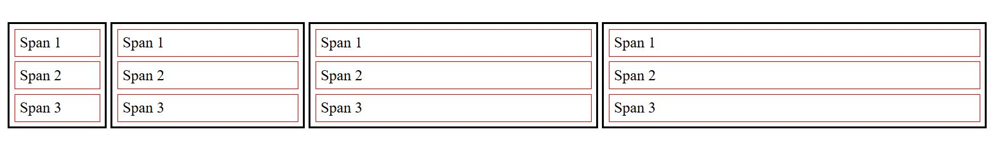

# Assignment 01: CSS Box Model & Display Property

## Objective

Practice utilizing the CSS Box Model, manipulating the `display` property, and using multiple CSS classes to create a specific layout structure.

## Instructions

### 1. HTML Structure

Create an HTML file with four paragraph (`
`) elements. Inside each paragraph, include three span (``) elements containing text (e.g., "Span 1", "Span 2", "Span 3").

### 2. Class Naming Strategy

Apply the [BEM (Block Element Modifier)](http://getbem.com/) style naming convention or standard multiple classes to your paragraphs.

1. **Base Class:** Give every paragraph element the class `box`.
2. **Modifier Classes:** Add a second, specific class to each paragraph in order from left to right:
   * First paragraph: `box--small`
   * Second paragraph: `box--medium`
   * Third paragraph: `box--large`
   * Fourth paragraph: `box--extra-large`

### 3. CSS Styling Requirements

#### Paragraph Elements (`
`)

* **Border:** Apply a `2px solid black` border.
* **Display:** Change the default display behavior so that the paragraphs sit **horizontally side-by-side** instead of stacking.
* **Dimensions:** Set the widths based on the modifier classes:
  * `.box--small`: `100px`
  * `.box--medium`: `200px`
  * `.box--large`: `300px`
  * `.box--extra-large`: `400px`

#### Span Elements (``)

* **Border:** Apply a `1px solid red` border.
* **Display:** Change the default display behavior so that the spans within the paragraphs **stack vertically** (taking up the full width), just like block elements.
* **Spacing:**
  * Add `5px` of **margin** on all sides.
  * Add `5px` of **padding** on all sides.

## Expected Outcome

You should see four black boxes of increasing width lined up in a row. Inside each black box, there should be three red boxes stacked on top of each other.

  

---
[Back to Day 04 README](./README.md)
