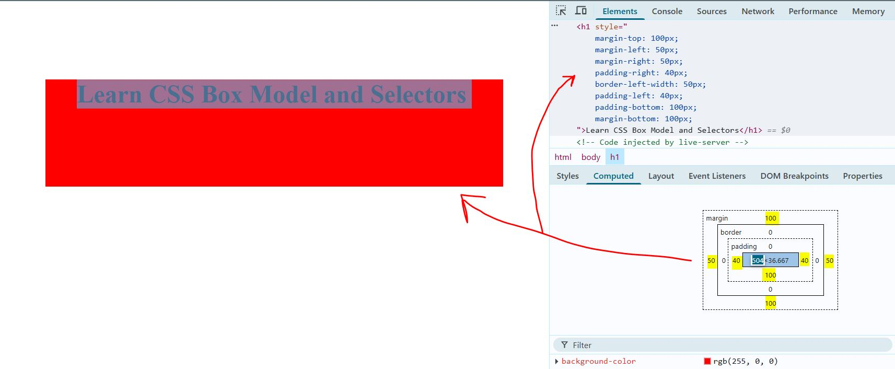
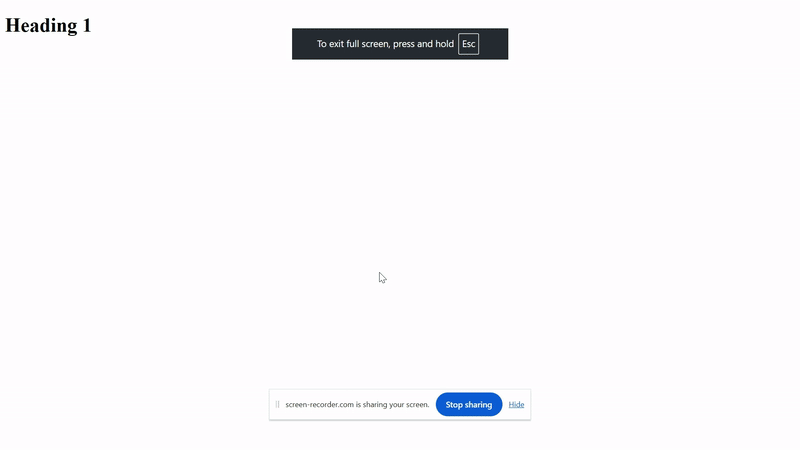

# Day 04: CSS Box Model, Selectors, and Chrome DevTools

## Table of Contents

- [Overview](#overview)
- [Key Topics & Activities](#key-topics--activities)
  - [1. Exploring the CSS Box Model](#1-exploring-the-css-box-model)
  - [2. Practicing CSS Selectors](#2-practicing-css-selectors)
  - [3. Visualizing Selector Effects](#3-visualizing-selector-effects)
  - [4. Chrome DevTools Workflow](#4-chrome-devtools-workflow)
- [Code Sample](#code-sample)
- [Reflections](#reflections)

## Overview

This session focused on practical use of the CSS Box Model, some CSS selectors, and efficient workflows in Chrome DevTools. Key skills included inspecting and modifying element layout, applying selectors, visualizing their effects, and managing files directly in DevTools.

---

## Key Topics & Activities

### 1. Exploring the CSS Box Model

- Used Chrome DevTools to inspect elements and understand the box model: **margin**, **border**, **padding**, and **content**.
- Modified **margin**, **padding**, and **content** size live to see immediate visual changes.

  
  

### 2. Practicing CSS Selectors

Explored a variety of CSS selectors to target elements:

- By tag name: `p { ... }`
- By attribute: `[id] { ... }`
- By attribute and value: `[id="paragraph3"] { ... }`
- By tag name + attribute + value: `p[id="paragraph3"] { ... }`
- By ID: `#paragraph4 { ... }`
- By class: `.blue-box { ... }`

> [!TIP]
> **When to use which selector:**
>
> - **ID Selector (`#id`)**: Use for a unique element on the page. Each ID should only be used once per page.
> - **Class Selector (`.class`)**: Use for styling multiple elements that share the same style. Classes can be reused on any number of elements.
> - **Tag Name Selector (`tagname`)**: Use to style all elements of a certain type (e.g., all `
` tags).
> - **Attribute Selector (`[attribute]`)**: Use to style elements that have a specific attribute, regardless of its value.
> - **Attribute and Value Selector (`[attribute="value"]`)**: Use to style elements with a specific attribute and a specific value.
> - **Tag + Attribute Selector (`tag[attribute="value"]`)**: Use to style a specific type of element with a specific attribute and value.
>
> **Summary:**
>
> - Use **ID** for one-of-a-kind elements
> - Use **class** for groups
> - Use **tag** for all of a type
> - Use **attribute** selectors for more specific targeting
>
> Choosing the right selector keeps your CSS efficient and maintainable.

> [!NOTE]
> Advanced selectors like `:nth-child()`, `:last-child()`, the child combinator (`>`), and the adjacent sibling combinator (`+`) were not covered due to time constraints. These are powerful tools for more precise element targeting and will be explored in future sessions.

### 3. Visualizing Selector Effects

- Applied different background colors to elements to clearly show which selectors matched which elements.

### 4. Chrome DevTools Workflow

- Loaded a project folder in the `Sources` tab, created or opened HTML files, and accessed them via the Chrome omnibox for live editing.

  

- Demonstrated how to download a webpage with all applied changes for local use, ensuring persistence of edits.

---

## Code Sample

See [index.html](./index.html) for the demo file used in this lesson.

---

## Reflections

Hands-on practice with the CSS Box Model and selectors in Chrome DevTools provided immediate visual feedback, making the effects of each selector clear. The workflow for loading folders and downloading modified pages in DevTools streamlines local development and experimentation.

---
[Back to Main README](../README.md)
