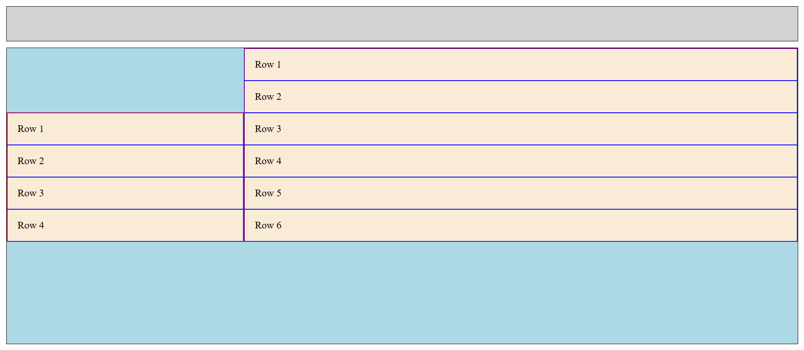
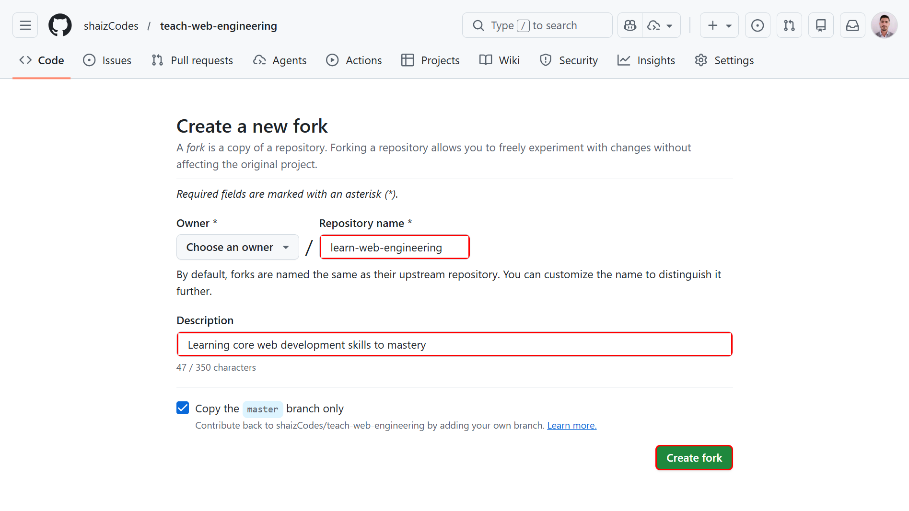

# Assignment 01: CSS Units & Layout

## Objective

Practice using CSS units to build a responsive layout and apply a predictable class naming strategy (BEM). Reproduce the provided layout image using the units learned in Day 05: `%`, `em`, `rem`, `vh`, `vw`, and `px`.

## Design Challenge Preview



## Instructions

### Setup

Fork the repository to get the assets, and to be able to submit your work.



### Forking Guidelines

- You may rename your fork to anything you prefer.
- Recommended repository name: `learn-web-engineering`.
- Recommended repository description: "Learning core web development skills to mastery".

### Submission Folder Convention

- Create your submission folder inside the day folder:

  `day-05/submissions/<your-github-username>/`

- Place your assignment files inside your folder (for example, `index.html`, `styles.css`, `README.md`).

### Deliverables Details

> [!NOTE]
> Make sure you tick the checkboxes for reference.

- [ ] An HTML file linked to a custom external CSS file
- [ ] Borders are of 1 pixel width and solid style
- [ ] The `body` element has padding equal to one unit of its font size
- [ ] The `#header` is a **black**(#000000) bordered element with `lightgray` background
- [ ] The `#body` is a **black**(#000000) bordered element with `lightblue` background
- [ ] The `#header` and `#body` are separated by 1 unit of root element font size
- [ ] The `#header` has height equal to 10 units of the viewport, while the height of `#body` is calculated dynamically to span the remaining viewport height
- [ ] The `.row` is a **blue**(#0000FF) bordered element with padding equal to its parent container font size
- [ ] The `.col` elements are **red**(#FF0000) bordered elements with `antiquewhite` background
  - [ ] The `.col` has 1 unit padding of its parent font-size
  - [ ] `#col-1` is 30 percentage of its parent horizontally, while `#col-2` is 70 percent
  - [ ] Both these elements are next to one another in the same line and their width is dynamically computed
  - [ ] The `#col-1` has 4 nested elements, while `#col-2` has 6

> [!TIP]
> `calc()` can be used with multiple and different CSS units to compute values.
> e.g.,
>
> ```css
> {
>   width: calc(30vh + 120% - 1em - 0.5rem);
> }
> ```

## Hints

- Change `html { font-size: 16px; }` and observe how `rem`-based values remain stable while `em`-based paddings inside components change when you alter parent font-size.
- Resize the browser to observe `vh`/`vw` effects.

---

[Back to Day 05 README](./README.md)
