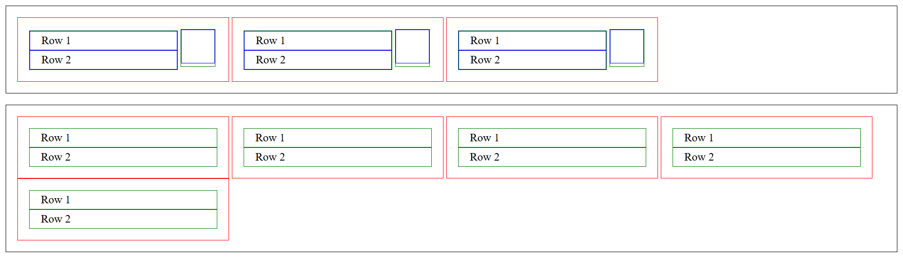

# Assignment 01: Cards Layout with BEM

## Objective

Practice BEM naming and spacing rules while recreating a cards layout with specific border and padding requirements.

## Design Challenge Preview

## Instructions

### Setup

Fork the repository to get the assets, and to be able to submit your work.

### Forking Guidelines

- You may rename your fork to anything you prefer.
- Recommended repository name: `learn-web-engineering`.
- Recommended repository description: `Learning core web development skills to mastery`.

### Submission Folder Convention

- Create your submission folder inside the day folder:

  `day-06/submissions/<your-github-username>/`

- Place your assignment files inside your folder (for example, `index.html`, `styles.css`, `README.md`).

### Deliverables Details

> [!NOTE]
> Make sure you tick the checkboxes for reference.

- [ ] An HTML file linked to a custom external CSS file
- [ ] Use BEM naming: `cards`, `card`, `card__title`, `card__description`, and `card__icon`
- [ ] Default borders are `1px solid black`
- [ ] Every `.card` is of 300 pixel width
- [ ] Create BEM modifier classes for border colors: red, green, and blue
- [ ] `.cards` and `.card` have `1em` padding
- [ ] `.card__title` and `.card__description` have `0.25em 1em` padding
- [ ] In the first `.cards` container, the first `.card` contains two green boxes
  - [ ] The second green box contains a blue box sized `48px` by `48px`
- [ ] The last `.cards` container has `margin-top: 1rem`

---

[Back to Day 06 README](./README.md)
