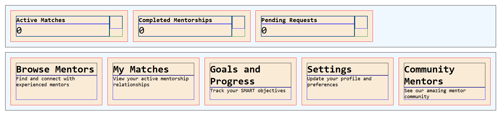

# Day 07: Assignment – Build a Mentorship Dashboard

## Objective

Practice CSS Flexbox layout and card-based UI design while recreating a mentorship dashboard with proper spacing, alignment, and responsive layout.

## Design Challenge Preview

## Instructions

### Setup

Fork the repository to get the assets, and to be able to submit your work.

### Forking Guidelines

- You may rename your fork to anything you prefer.
- Recommended repository name: `learn-web-engineering`.
- Recommended repository description: `Learning core web development skills to mastery`.

### Submission Folder Convention

- Create your submission folder inside the day folder:

  `day-07/submissions/<your-github-username>/`

- Place your assignment files inside your folder (for example, `index.html`, `styles.css`, `README.md`).

### Deliverables Details

> [!NOTE]
> Make sure you tick the checkboxes for reference.

### Section 1: Metrics Cards

A row of three cards displaying key metrics:

- **Active Matches** (with value "0")
- **Completed Mentorships** (with value "0")
- **Pending Requests** (with value "0")

Each card should contain:

- A title (smaller, bold text)
- A large value/number
- Space for an icon on the right side

### Section 2: Details/Navigation Cards

A grid of five cards arranged in rows, each containing:

- **Card 1**: Browse Mentors – "Find and connect with experienced mentors"
- **Card 2**: My Matches – "View your active mentorship relationships"
- **Card 3**: Goals and Progress – "Track your SMART objectives"
- **Card 4**: Settings – "Update your profile and preferences"
- **Card 5**: Community Mentors – "See our amazing mentor community"

Each card should have:

- A heading (larger text)
- A description/subtitle text below it

## Requirements

### HTML

- Use semantic HTML5 elements appropriately (`div`, `span`, `h1`, `p` as needed)
- Create a meaningful structure with containers for sections
- Use appropriate class names (e.g., `container`, `card`, `metrics`, `details`)
- Follow the structure shown in the screenshot

### CSS

- Reset default user-agent styles, and set `box-sizing` to `border-box` for all elements
- Use **Flexbox** for the assignment
- Create reusable utility classes like `.border`, `.container`, `.container--column`, etc.
- Use `monospace` font family
- Style cards with:
  - Background color; `aliceblue`, and `antiquewhite`
  - Mind the internal spacing

### Flexbox Layout

- Display three cards in a single row
- Use `gap` property for consistent spacing between items
- The card headings should grow when applicable, while the cards themselves are 300px wide
- Icons should be of `32x32` pixels in size

### Styling Details

- Use borders to debug/visualize layout (optional, can be removed in final version)
- Text sizing:
  - Card titles: ~1.25em
  - Large values: ~2em
  - Regular text: default size

## Deliverables Checklist

- [ ] An HTML file linked to a custom external CSS file
- [ ] Use utility classes: `container`, `container--column`, `card`, `metrics`, `details`, `border`, `border--red`, `border--green`, `border--blue`
- [ ] Reset default styles: `box-sizing: border-box`, `margin: 0`, `padding: 0`
- [ ] Use `monospace` font family for body
- [ ] **Metrics section**: Three cards displayed in a single row with `gap` property
  - [ ] Each card is `300px` wide
  - [ ] Cards contain title, value, and icon placeholder
  - [ ] Title is ~1.25em, value is ~2em
  - [ ] Icons are `32x32px`
- [ ] **Details section**: Five cards displayed with flex wrapping
  - [ ] Each card contains a heading and description
  - [ ] Cards wrap to multiple rows as needed
- [ ] Background colors: `aliceblue` for sections, `antiquewhite` for cards
- [ ] Proper padding: `1em` for containers and cards
- [ ] Flexbox is used for all layout (no floats, absolute positioning, or CSS Grid)

## Resources

- [CSS-Tricks: A Complete Guide to Flexbox](https://css-tricks.com/snippets/css/a-guide-to-flexbox/)
- [MDN: Flexbox](https://developer.mozilla.org/en-US/docs/Web/CSS/CSS_Flexible_Box_Layout)
- [Flexbox Froggy](https://flexboxfroggy.com/) – Interactive practice game
- [Day 07 README](./README.md) – Lecture notes and key concepts

---

[Back to Day 07 README](./README.md)
