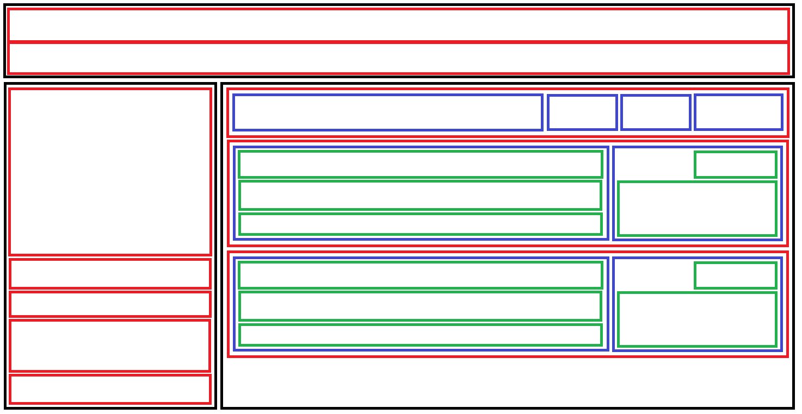

# Day 08: Assignment – Build a Flexbox Layout

## Objective

Practice CSS Flexbox layout techniques by recreating a multi-section layout with proper spacing, alignment, and responsive design principles.

## Design Challenge Preview

## Instructions

### Setup

Fork the repository to get the assets, and to be able to submit your work.

### Forking Guidelines

- You may rename your fork to anything you prefer.
- Recommended repository name: `learn-web-engineering`.
- Recommended repository description: `Learning core web development skills to mastery`.

### Submission Folder Convention

- Create your submission folder inside the day folder:

  `day-08/submissions/<your-github-username>/`

- Place your assignment files inside your folder (for example, `index.html`, `styles.css`, `README.md`).

### Deliverables Details

> [!NOTE]
> Make sure you tick the checkboxes for reference.

### Layout Structure

Recreate the flexbox layout shown in the screenshot, which includes:

- **Header Section**: Navigation bars generally containing logo and navigation items
- **Main Content Area**: Multiple sections demonstrating different flexbox patterns
- **Cards/Components**: Various flex items arranged in rows and columns
- **Proper Spacing**: Consistent gaps between elements

The layout should demonstrate:

- Horizontal navigation alignment
- Vertical and horizontal flex containers
- Space distribution using `justify-content` and `align-items`
- Responsive flex wrapping
- **Nested flex containers**

## Requirements

### HTML

- Use semantic HTML5 elements appropriately (`header`, `nav`, `main`, `a`, etc)
- Create a logical structure with containers for each section
- Use meaningful class names (e.g., `container`, `navbar`, `flex--row`, `flex--column`)
- Follow the structure shown in the screenshot

### CSS

- Reset default user-agent styles and set `box-sizing` to `border-box` for all elements
- Use **Flexbox** exclusively for layout (no floats or positioning)
- Create reusable utility classes like `.flex`, `.flex--row`, `.flex--column`
- Style elements with:
  - Background colors for visual distinction
  - Proper padding and margins
  - Border styling where appropriate

### Flexbox Layout

- Use `display: flex` on container elements
- Apply appropriate `flex-direction` values (`row` or `column`)
- Use `justify-content` to distribute space along the main axis
- Use `align-items` to align items on the cross axis
- Implement `gap` property for consistent spacing between flex items
- Use `flex-wrap` where items should wrap to new lines
- Apply `flex-grow` to control item sizing

> [!TIP]
> **Bonus Challenge:** Explore `flex-shrink` and `flex-basis` properties to gain a deeper understanding of flex item sizing. These properties control how items shrink and their base size, giving you more fine-grained control over flexbox layouts.

### Styling Details

- Use borders to visualize layout structure
- Consistent spacing throughout the layout
- Colors should match or closely approximate the screenshot

## Deliverables Checklist

- [ ] An HTML file linked to a custom external CSS file
- [ ] Use utility classes: `.container`, `.flex`, `.flex--row`, `.flex--column`
- [ ] Reset default styles: `box-sizing: border-box`, `margin: 0`, `padding: 0`
- [ ] All layouts created using flexbox (no floats or absolute positioning)
- [ ] **Header/Navigation section**:
  - [ ] Logo or brand name aligned to the left
  - [ ] Navigation items with proper spacing
  - [ ] Flex container with `justify-content: space-between`
- [ ] **Content sections**: Multiple flex containers demonstrating different patterns
  - [ ] Horizontal flex rows
  - [ ] Vertical flex columns
  - [ ] Nested flex containers
  - [ ] Proper use of `gap` for spacing
- [ ] **Responsive behavior**: Elements wrap or adjust based on content
- [ ] Proper padding and margins throughout
- [ ] Layout matches the provided screenshot

## Resources

- [CSS-Tricks: A Complete Guide to Flexbox](https://css-tricks.com/snippets/css/a-guide-to-flexbox/)
- [MDN: Flexbox](https://developer.mozilla.org/en-US/docs/Web/CSS/CSS_Flexible_Box_Layout)
- [MDN: justify-content](https://developer.mozilla.org/en-US/docs/Web/CSS/justify-content)
- [MDN: align-items](https://developer.mozilla.org/en-US/docs/Web/CSS/align-items)
- [Flexbox Froggy](https://flexboxfroggy.com/) – Interactive practice game
- [Day 08 README](./README.md) – Lecture notes and key concepts

---

[Back to Day 08 README](./README.md)
