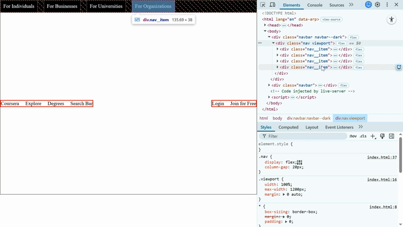

# Day 08: Flexbox Layouts

## Table of Contents

- [Overview](#overview)
- [Key Topics & Activities](#key-topics--activities)
  - [Building Navigation Bars](#building-navigation-bars)
  - [Header Layout Patterns](#header-layout-patterns)
  - [Advanced Alignment Techniques](#advanced-alignment-techniques)
- [Assignment](#assignment)
- [Demo](#demo)
- [Reflections](#reflections)
- [References](#references)

## Overview

Today we continued our exploration of CSS Flexbox by building practical navigation bar and header layouts. We applied the flexbox properties learned in [Day 07](../day-07/) to create real-world navigation components commonly found in modern web applications.

## Key Topics & Activities

### Building Navigation Bars

Navigation bars are one of the most common use cases for flexbox. Key patterns we explored:

- **Horizontal navigation menus**: Using `flex-direction: row` (default)
- **Space distribution**: Applying `justify-content: space-between` to add spaces between elements in main-axis
- **Vertical alignment**: Using `align-items: center` for proper centering in cross-axis
- **Spacing between items**: Using `gap` (`row-gap`, `column-gap`) for consistent spacing, generally with `flex-wrap: wrap;`
- **Nested flex containers**: Creating complex layouts with flex items by also converting those to flex containers

### Header Layout Patterns

Common header structures implemented:

- **Brand + Navigation + Actions**: Three-part header with brand on left, navigation in center, actions on right
- **Dark header bars**: Using background colors and contrasting text
- **Multi-level navigation**: Primary and secondary navigation bars stacked vertically
- **Viewport constraints**: Using max-width containers with auto margins for centered layouts

> [!NOTE]
> We used non-semantic elements just to focus on flexbox properties. Generally, using semantic and right elements are recommended. For example, `nav` instead of `div` for navigation, and `a[href=""]` instead of `span` for navigation links is the actual approach.

### Advanced Alignment Techniques

We explored specific alignment scenarios:

- **Pushing items to opposite ends**
  - `margin-inline-start: auto` to push elements to the right
  - `margin-inline-end: auto` to move to left
  - `justify-content: space-between` on flex containers for both ends...
- **Centering containers**:
  - `margin-inline: auto` to center elements horizontally
  - `margin-block: auto` to center elements vertically
  - `margin: 0 auto;` to center both horizontally while removing the block margins (vertical spacing)
  - Combining `height` with `align-items: center` for flex containers
- **Whitespace control**: Using `white-space: nowrap` to prevent text wrapping in navigation items

## Assignment

- [Assignment: Clone the given layout](./ASSIGNMENT.md)

## Demo

See `index.html` for working examples of navigation bars built with flexbox, including:

- Dark header navigation with horizontal menu items
- Two-section layout with left and right navigation groups
- Centered viewport container with max-width constraint

Open the file in your browser and use Chrome DevTools to experiment with `justify-content`, `align-items`, and `gap` values.

> 
> Exploring CSS flex-wrap and flex-grow properties in navigation layouts

## Reflections

- What are the benefits of using nested flex containers versus a single flat container?
- When building navigation bars, what are different approaches to push items to the right side?
- How does `white-space: nowrap` affect flex item behavior in navigation menus?

## References

- [MDN: white-space](https://developer.mozilla.org/en-US/docs/Web/CSS/white-space)
- [MDN: CSS Logical Properties](https://developer.mozilla.org/en-US/docs/Web/CSS/CSS_Logical_Properties)
- [CSS-Tricks: A Complete Guide to Flexbox](https://css-tricks.com/snippets/css/a-guide-to-flexbox/)
- See [Day 07 README](../day-07/README.md) for foundational Flexbox concepts

---

[Back to Main README](../README.md)
